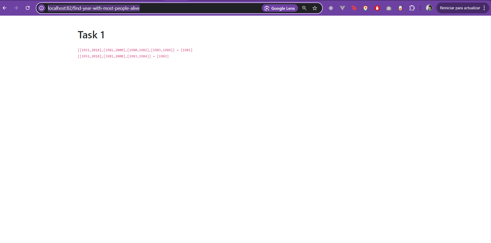
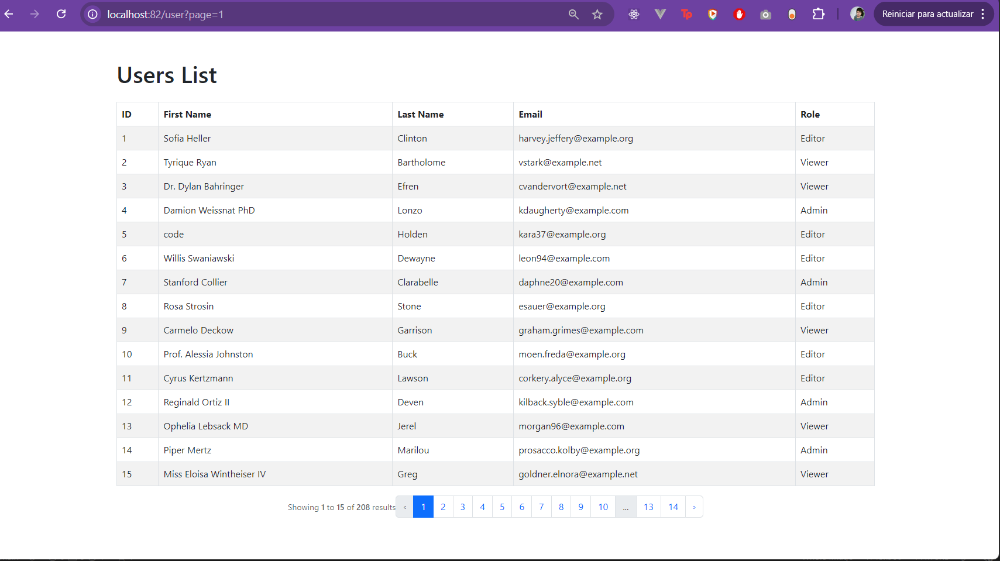
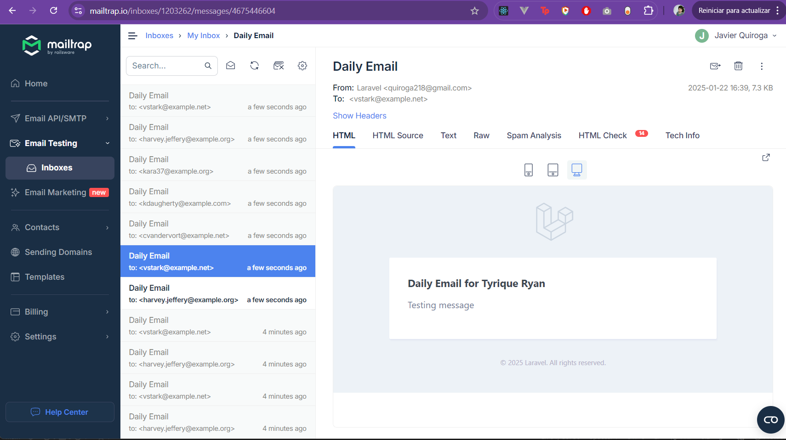

# INSTALLATION:

1. Install Docker 
2. If you have a Windows OS, you must install wsl v2 and a linux distribution (Example: Ubuntu, Linux Mint, Debian, etc.)
3. WLS v2 installation resource: https://docs.microsoft.com/en-us/windows/wsl/install
4. Once you have WSL v2 enabled and a distribution installed on your Windows OS, you need to move the project to the Linux distribution (\\wsl.localhost\Ubuntu\home\user)
5. Install `php8.2` in your OS 
6. Intall Composer and once you have installed run in the root directory of the project the command `composer install` to install the dependencies and packages in the vendor directory
7. Create the project configuration file using the `cp .env.example .env` command.
8. Execute `composer vm:start` command to run laravel sail
9. Execute  `composer app:install` command to install app
10. Access site at <http://localhost> *(:warning: in case another local site is using port 80 you will need to change it in env. file)*


 ### Available Commands

This project uses custom scripts defined in the `composer.json` file to run common tasks such as managing the development environment, database, and application setup.

## Commands Table

| **Command**                 | **Description**                                                             | **Usage**                              |
|-----------------------------|-----------------------------------------------------------------------------|----------------------------------------|
| `vm:start`         | Starts the Docker development environment in the background.                | `composer vm:start`                   |
| `table:migrate`    | Runs the migrations to set up the database tables.                          | `composer table:migrate`              |
| `db:seed`          | Populates the database tables with initial data.                            | `composer db:seed`                    |
| `vm:stop`          | Stops the Docker containers associated with the development environment.    | `composer vm:stop`                    |
| `vm:restart`       | Restarts the Docker containers for the project.                             | `composer vm:restart`                 |
| `app:install`      | Automatically runs migrations and seeds the database.                       | `composer app:install`                |
| `app:send-daily-email` | Sends the daily email as configured in the application in laravel sail.                     | `./vendor/bin/sail artisan app:send-daily-email`       |
| `schedule:work` | Sends the daily email as configured in the application in laravel sail.                     | `./vendor/bin/sail artisan artisan schedule:work`       |

## Example Workflow

1. **Start the environment:**
   ```bash
   composer vm:start
   ```
## Run email command manually
   ```bash
    ./vendor/bin/sail artisan app:send-daily-email
   ```

## Run scheduled email for users at 00:00:00
  ```bash
   ./vendor/bin/sail artisan artisan schedule:work
  ```

## Screenshots
 ### Task 1:


 ### Task 2:




